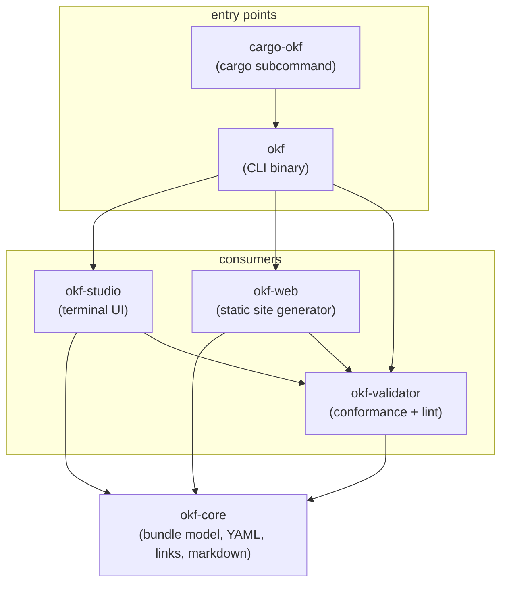
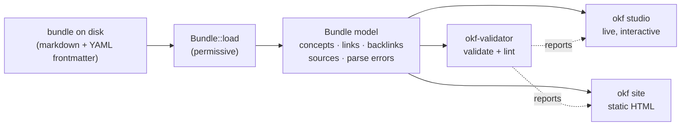
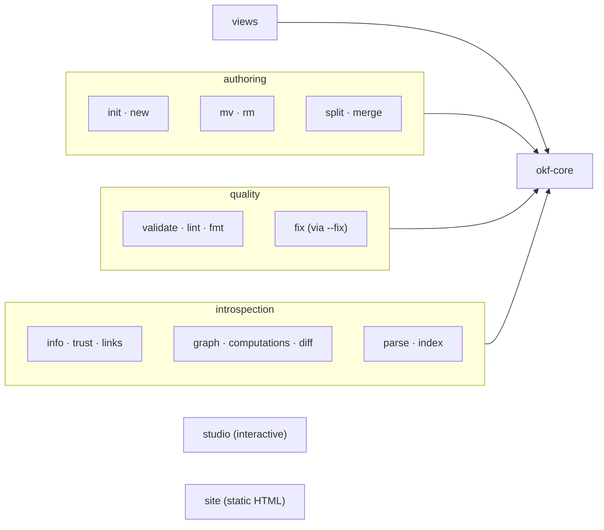
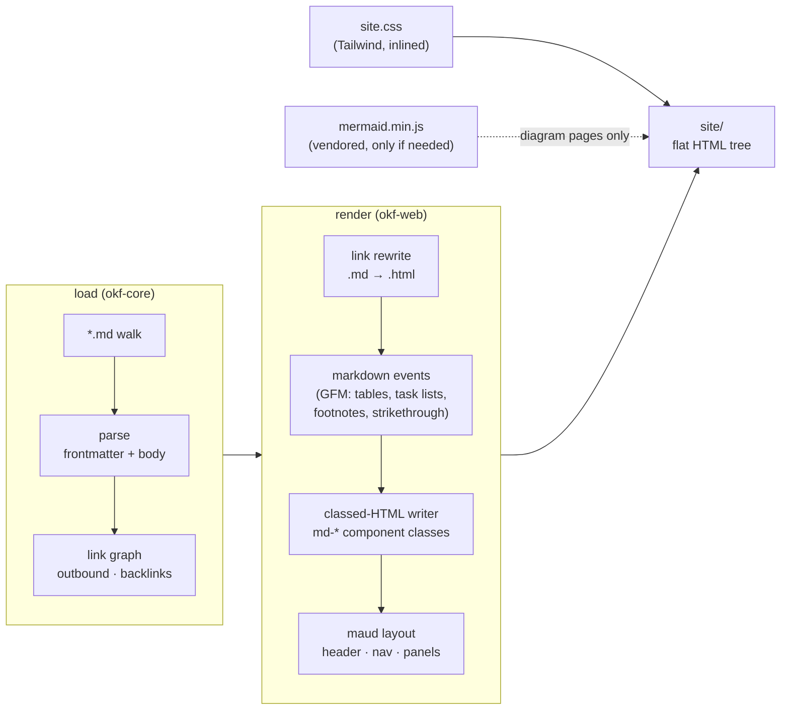

# OKF Workspace Architecture

The okf project is a Cargo workspace of six crates with one rule at its
center: **okf-core models the bundle; every other crate consumes it.** No
crate re-parses markdown or YAML on its own — they all share okf-core's
permissive loader, link graph, and frontmatter accessors.

## Workspace layout

Dependency direction only ever points inward. okf-core depends on the
standard library alone (its own YAML-subset parser, markdown link scanner,
directory walker). okf-validator adds conformance checking, linting, and
optional multi-language syntax parsers (oxc for JavaScript, RustPython for
Python). okf-studio renders the model interactively in the terminal;
okf-web renders it once at build time into static HTML. The `okf` binary
is a thin clap shell over all of them; `cargo okf` delegates to it.

## The one model, three views

okf-core's [`Bundle::load`] is permissive by design: parse errors, broken
links, and malformed frontmatter never abort a load — they are recorded on
the bundle and rendered as visible content. That single decision shapes
every consumer:

- **okf studio** holds one resident process: an Elm-style unidirectional
  loop (message → update → snapshot → view) over a continuously
  re-validated model, rendering with ratatui.
- **okf site** is the build-time pipeline: pulldown-cmark event stream →
  classed-HTML writer → maud page templates → one flat directory of HTML
  with inlined Tailwind CSS and vendored mermaid.js. No server, no WASM.
- **okf validator** is the only crate that judges; both views display its
  reports but never duplicate its rules.

## CLI surface

The `okf` binary maps every model capability onto a subcommand; the
interactive studio and the site generator are just the two "view"
subcommands at the ends of the list:

Every subcommand shares the same guarantee: bundle problems are reported,
not fatal. `--json` exists on nearly all of them so agents (the "a" in
OKF's human- *and* agent-friendly design) can drive the same surface
people do.

## Data flow through the site generator

As the newest consumer, okf-web illustrates the permissive pipeline end
to end:

The stylesheet is compiled once with the Tailwind standalone CLI
(`cargo xtask tailwind`) and committed, so `okf site` itself needs no
toolchain; the generator embeds it with `include_str!` at build time.

## Design rules worth preserving

1. **One model.** New capability lands in okf-core (or okf-validator for
   judgment), never duplicated in a consumer.
2. **Permissive in, safe out.** Producer mistakes surface as content;
   producer HTML is dropped at render time, never passed through.
3. **Minimal dependencies.** okf-core stays std-only; heavier parsers in
   okf-validator are optional features; okf-web carries only maud and
   pulldown-cmark.
4. **Two entry points, one binary.** `cargo okf` wraps `okf`; no logic
   lives in either shell.
