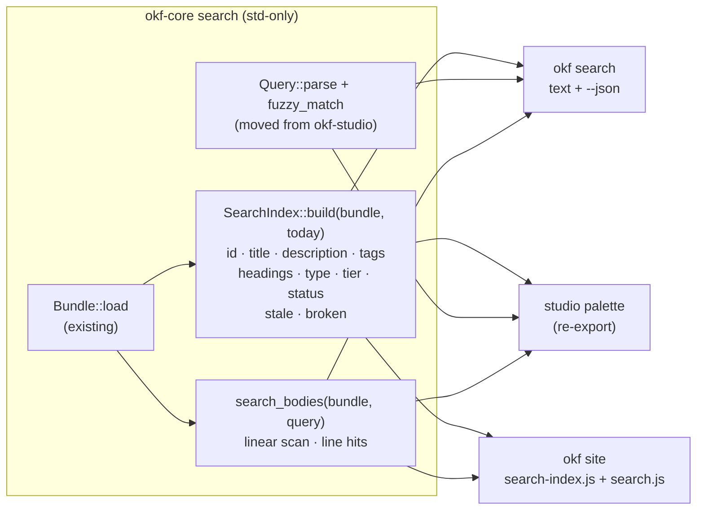

# First-class search: one engine in okf-core, three surfaces

## Motivation

Search exists in exactly one of the three views, by accident of history. The
studio has a good engine — a Smith-Waterman-style fuzzy matcher with
smart-case, boundary bonuses, and a composable filter syntax
(`#tag`, `type:`, `tier:`, `status:`, `is:stale`, `is:broken`) – but it lives
inside the TUI crate[^studio-search]. The CLI has no search verb at all: an
agent that wants "which concepts mention mileage, filtered to stale ones"
has to read the whole bundle. And `okf site` renders a search input in every
page header that does nothing – it was deferred out of the web plan's v1
scope[^web-plan].

The okf-web decision record already predicted the fix: "if shared
derivations grow, the clean move is extracting them into
okf-core"[^web-adr]. Three consumers now want the same engine, so that move
is due. This plan supersedes the web ADR's "post-build pagefind later" line
– the reasoning is in [the companion decision record](../decisions/okf_search_engine.md).

## Scope

In scope:

- **okf-core gains a std-only `search` module**: the engine extracted from
  `okf-studio/src/search.rs` (moved, not rewritten), plus
  `SearchIndex::build(&Bundle, Option<Date>)` so any consumer can build the
  index without the studio's snapshot machinery, plus a body-text scanner
  `search_bodies`.
- **`okf search` CLI subcommand**: shared query syntax, fuzzy metadata hits,
  grep-style body hits with line numbers, `--json`, `--today`, `--limit`.
- **Studio cutover**: `okf-studio` deletes its copy and re-exports
  `okf_core::search`; the palette additionally surfaces body-text rows.
- **Site search**: `okf site` emits a build-time `search-index.js` asset
  built from the shared `SearchIndex`, and a small first-party vanilla-JS
  client makes the existing header input work: lazy-loaded, keyboard-driven
  dropdown mirroring the studio palette.

Out of scope:

- Ranking models (TF-IDF, BM25), stemming, or any external search binary
  (pagefind, tantivy) — bundles are small structured corpora; frontmatter
  filters beat relevance ranking at this scale.
- Fuzzy matching over bodies — bodies get exact smart-case substring hits;
  fuzzy-over-prose is noise.
- Cross-bundle search, searching `index.md`/`log.md` reserved files, or
  unparseable files (they carry no model to search).
- Server-side search of any kind; the site stays pure build-time output.

## Architecture

One engine, three projections. The engine is pure data over the permissive
`Bundle` — no validator dependency, no TUI dependency, std-only like the
rest of okf-core.



### What moves

`okf-studio/src/search.rs` moves to `crates/okf-core/src/search.rs` with
these changes and nothing else:

- `SearchEntry`, `SearchIndex`, `SearchHit`, `Filter`, `Query`,
  `fuzzy_match`, the scoring constants, and their unit tests move verbatim
  (studio lints are the workspace lints; core adds `missing_docs`, which
  the module already satisfies).
- New `SearchIndex::build(bundle: &Bundle, today: Option<Date>) ->
  SearchIndex`. Every field the studio's `build_search` pulls from
  `ConceptMeta` is directly derivable in core, with identical semantics:
  `stale` = `concept.is_stale_on(today)` (same call `ConceptMeta` uses),
  `broken` = any `!link.exists` in `bundle.links_from(id)` (same rule as
  `ConceptMeta::broken_out > 0`), `headings` = `extract_headings(body)`
  (the same source `ConceptMeta` copies from), and the `today` fallback
  mirrors `Snapshot::build`'s `today_utc` fallback. Parity is proven by the
  studio's existing integration assertions passing unmodified.
- New body search, a scan rather than an index — bodies are already
  resident in the `Bundle`, so precomputing would only copy memory (and
  `SearchIndex` borrowing from a `Bundle` owned by the same `Snapshot`
  would be a self-referential struct):

  ```rust
  pub struct BodyHit {
      pub id: ConceptId,     // the concept whose body matched
      pub line: usize,       // 1-based body line
      pub snippet: String,  // the matching line, windowed around the match
      pub start: usize,     // match offset within the snippet, for highlighting
  }
  pub fn search_bodies(bundle: &Bundle, raw_query: &str, limit: usize) -> Vec<BodyHit>;
  ```

  `search_bodies` shares `Query::parse` (so `#hr mileage` scans for
  `mileage` only), matches smart-case substring per line (uppercase in the
  query forces exact match, mirroring `fuzzy_match`), one hit per line,
  sorted by concept order then line, truncated to `limit`.

- `okf-core/src/lib.rs` gains `pub mod search;` and the
  `#[doc(inline)] pub use search::{...}` re-export line, so `use okf::...`
  library consumers get it for free through the existing
  `pub use okf_core::*`.

### The shared query syntax

One syntax, documented once (README), parsed by one Rust implementation and
one deliberate JS port (site). Filters compose with AND; the free-text part
feeds both the fuzzy index and the body scan.

| Term          | Meaning                          | Matches                       |
|---------------|----------------------------------|-------------------------------|
| `#tag`        | frontmatter tag                  | `tags` (case-insensitive)     |
| `type:X`      | concept type                     | `type`                        |
| `tier:X`      | trust tier                       | `human-reviewed`, `machine-confirmed`, `unverified` |
| `status:X`    | lifecycle status                 | `status`                      |
| `is:stale`    | stale on `today` (or `--today`)   | derived flag                  |
| `is:broken`   | has broken outgoing links         | derived flag                  |
| anything else | fuzzy free text                  | id, title, description, tags, headings; bodies by substring |

`okf search "is:stale"` with an otherwise-empty text query lists every stale
concept — it composes with `tier:unverified` into an attention queue, which
makes search the natural scripting surface for `--json` consumers.

## CLI: `okf search`

`SearchArgs` follows the read-command conventions (`ValidateArgs` shape):

- `terms: Vec<String>` — positional, required, `num_args = 1..`, joined
  with spaces into the query. Bundle resolution mirrors `okf new`'s dual
  convention: if the first term names an existing directory and there are
  two or more terms, it is the bundle and the rest is the query; otherwise
  the `--bundle` flag (default `.`) applies and all terms are the query.
- `--limit N` (default 20, per hit class), `--today`, `--json`/`-j`,
  `--format`, matching every other subcommand.

Text output (two classes, metadata first — the same order the palette and
the site dropdown use):

```text
policies/travel_expenses [stable] Travel and expense policy
  policies/travel_expenses # Reimbursement rates
  policies/travel_expenses.md:14  …reimbursed at 0.67 per mile…
computations/mileage_calc [stable] Mileage reimbursement calculator

2 metadata hit(s), 1 body hit(s)
```

JSON output mirrors `print_trust_json`'s hand-built `serde_json` shape:
`{ "query", "hits": [{ "id", "heading", "label", "score" }],
"body_hits": [{ "id", "line", "snippet", "start" }] }`. Exit code is 0 for
zero hits (read-only introspection commands never fail on empty results;
JSON `[]` is the scriptable signal), non-zero only for load errors.

## Site: build-time index, first-party client

The site gains two always-written assets (the search input is on every
page, so — unlike mermaid/shiki — the index is unconditionally part of the
contract; it is *fetched* lazily, only on first keystroke):

- `assets/search-index.js` — `window.okfSearchIndex = {json}` built by
  serializing `SearchIndex::build(&bundle, today)` (the same call the CLI
  and studio make) plus a `bodies` array of `{id, url, body}`. Emitted with
  `serde_json` (a new, boring okf-web dependency — hand-rolled JSON
  escaping is a bug farm), post-processed to replace `<` with `\u003c`,
  `&` with `\u0026`, and U+2028/2029 with their escapes, keeping the file
  valid JS in every browser and inert if ever inlined into HTML. Heading
  entries carry `{text, anchor}` where `anchor` is computed by the *same*
  slug-disambiguation the page writer uses (`-1`, `-2`, … suffixes) — the
  dedup loop moves from `okf-web/src/markdown.rs` into a shared
  `okf_core::markdown` helper so index anchors and emitted `id=` attributes
  cannot drift; a test asserts the pairing.
- `assets/search.js` — first-party, ~150 lines of vanilla JS, embedded
  with `include_str!` and written next to the index. It ports
  `fuzzy_match` (same scoring constants, documented as a manual port) and
  `Query::parse`, then: on the first `input` event it injects
  `<script src="{prefix}assets/search-index.js">` (classic script — the
  established mechanism that works over `file://`), and on load runs the
  query. Results render in a dropdown under the header input, capped at 14
  rows like the palette, with `↑`/`↓`/`Enter`/`Esc` mirroring the studio
  keymap; `Enter` navigates to `concept.html`, heading hits to
  `concept.html#anchor`, body hits to the page with the snippet shown in
  the row. All rows are built with `document.createElement` +
  `textContent` only — bundle bodies are producer content and never touch
  `innerHTML`, preserving the crate's "producer HTML is dropped" posture.
  With JS off, the input degrades to an inert field — the site stays
  readable, search simply is not available, same as mermaid/shiki.
  Dropdown styling extends `assets/tailwind.css`
  (`.site-search-results` et al.) and re-vendors via `cargo make tailwind`.
  Depth-correct asset prefixes reuse the `prefix_for` logic already
  emitted per page.

Determinism carries over unchanged: `--today` pins staleness flags in the
index, and two builds of the same bundle produce byte-identical assets.

## Studio cutover

- `crates/okf-studio/src/search.rs` is deleted;
  `pub mod search;` becomes `pub use okf_core::search;`, so every existing
  `crate::search::…` path (app.rs palette, snapshot.rs, ui/graph.rs,
  overlays.rs, refactor_modal.rs, tests) keeps compiling without edits.
- `Snapshot::build`'s `build_search` collapses to
  `SearchIndex::build(&bundle, today)` — `ConceptMeta` stays for the panes
  that still need it.
- The palette adds body-hit rows beneath metadata rows (label
  `line 14: snippet…`); `Enter` opens the concept at top. Line-precise
  scrolling is explicitly deferred — the reader wraps long lines, so a
  line→row map is its own feature with its own trigger.

## Wiring into the workspace

- **No new crates, no feature gates.** `search` is core, so it is always
  compiled; the CLI subcommand needs no `#[cfg]` (the binary already
  requires `validator`, and `serde_json` sits behind it); `cargo-okf`
  delegates to the `okf` CLI and inherits for free; the `okf` library
  re-exports it via the existing `pub use okf_core::*`.
- **Dependencies**: okf-core stays empty-dep (std-only). okf-studio drops
  nothing (okf-core was already its dependency). okf-web adds
  `serde_json` only, justified in its Cargo.toml against the hand-rolled
  alternative.
- **CI**: unchanged. Core's new tests run in the default test job; the
  minimal-features job already clippy's and tests every touched crate
  (`--no-default-features` builds stay green because search is
  unconditional).

## Phasing

1. **Milestone 1 — okf-core `search` module.** Move the engine, add
   `SearchIndex::build` and `search_bodies`, port the unit tests, add build
   parity tests (index from a tempdir bundle vs `ConceptMeta`-derived
   facts: stale, broken, headings) and body-hit tests (smart-case, line
   numbers, filter-aware free text, limit). Acceptance: `cargo test -p
   okf-core` green; `cargo tree -p okf-core` shows no dependencies.
2. **Milestone 2 — studio cutover.** Delete the studio copy, re-export,
   collapse `build_search`, add palette body rows. Acceptance: the studio
   suite passes with only the module-path edit (`/`-palette assertions,
   `pte` → travel_expenses, `is:stale` → remote_work, unmodified); manual
   check — palette opens, filters compose, a body row jumps to its concept.
3. **Milestone 3 — CLI `okf search`.** Subcommand, text + JSON printers,
   `--today`/`--limit`. Acceptance: new `crates/okf/tests/cli_search.rs`
   passes over a tempdir bundle (tempdir fixture per the existing
   `cli_run.rs` pattern): fuzzy hits, each filter, body hits with correct
   line numbers, JSON shape, `okf search <dir> query` bundle heuristic,
   exit code 0 on zero hits.
4. **Milestone 4 — site search.** Index serialization with the escaping
   pass, the shared slug-dedup helper, `search.js` + tailwind re-vendor,
   lazy load. Acceptance: `crates/okf-web/tests/site.rs` additions pass
   (asset emitted, entry fields, `<script>` in a title lands escaped in the
   asset, index anchors match emitted `id=`s); browser-verified per the
   repo's web precedent — type in the header input, dropdown appears,
   filters apply, `Enter` navigates, heading hits land on the anchor, no
   console errors, works from `file://`.
5. **Milestone 5 — docs and release.** README: a `search` section in the
   CLI reference (the query-syntax table above becomes the canonical doc),
   a `--json` example, a site-search paragraph; this knowledge base: the
   ADR supersede line and log entries (done at plan time), plus
   post-implementation log entry; version bump per the repo release
   process.

## Risks

- **Scorer drift** between the Rust engine and the JS port. Mitigation:
  the port carries the same constants with a keep-in-sync comment; both
  sides are small enough to eyeball against shared fixtures, and any felt
  divergence is a bug against this plan, not a tuning exercise.
- **Index asset size** ≈ the bundle's body text. Acceptable: it is fetched
  only when a query is typed, gzips to a fraction on any static host, and
  is exactly what any client-side search (pagefind included) must ship.
- **Slug-dedup drift** between page writer and index. Eliminated by
  construction: one shared helper, one parity test.
- **Bundle heuristic ambiguity** (`okf search ./docs is:stale` vs a query
  term that names a directory). Mirrors `okf new`'s accepted convention;
  `--bundle` always disambiguates.
- **Studio line-jump temptation** (scrolling a palette body hit to its
  line). Deferred explicitly above; the reader's wrap model makes it a
  real feature, not a bolt-on.

## Verification

- `okf validate` and `okf lint` against this knowledge base after every
  edit; both must pass with no errors.
- `cargo test --workspace` and `cargo clippy --all-targets --all-features`
  at every milestone boundary (CI parity locally).
- Milestone acceptance criteria above, each runnable as stated — including
  the browser check for the site, which is the repo's stated proof
  standard for `okf-web` work.
- Determinism: `okf site <bundle> --today 2026-09-14` twice produces
  byte-identical `search-index.js`.

[^okf-repo]: okf workspace repository
[^studio-search]: The studio's fuzzy matcher, omnisearch index, and shared query syntax
[^web-plan]: okf-web static site generator plan
[^web-adr]: okf-web naming and dependency decision record
[^pagefind]: pagefind static site search
